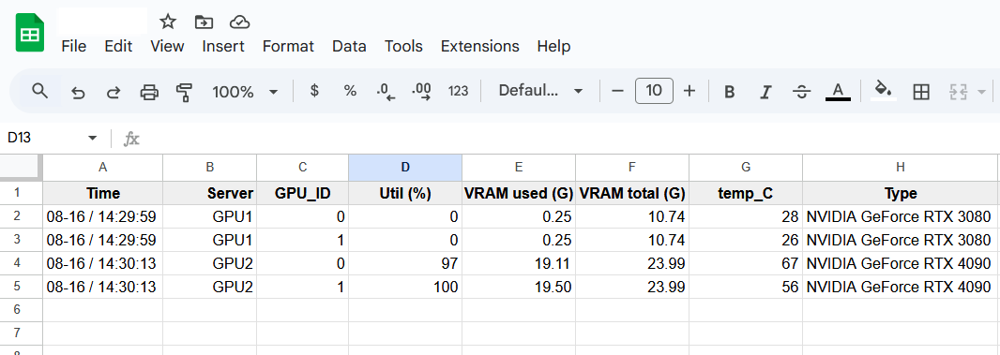
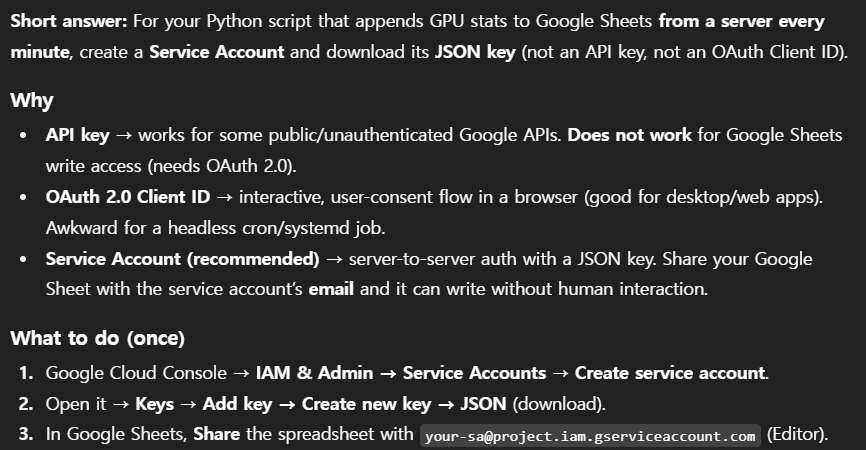

### GPU Usage Logger (Google Sheet)



Simple GPU-usage logger based on Google Cloud API
* Google Cloud Service instructions from ChatGPT (written in 25.08, **DO NOT UPLOAD YOUR CREDIENTIAL FILES ONLINE!**)  
  
* Google Sheet example color & number formattings example [link](https://docs.google.com/spreadsheets/d/1CgUvc--pjhSz-DaDB7aL1pu_jVzZ7MLml-cEmmmwe8Q/edit?usp=sharing)
* Required python packages:  
  ```pip install pynvml psutil gspread google-auth pytz```
* Without using python virtual enviornment we encountered an error related to external package restrictions. We used the following command to resolve the problem:  
  ```python3 -m pip config set global.break-system-packages true``` 
